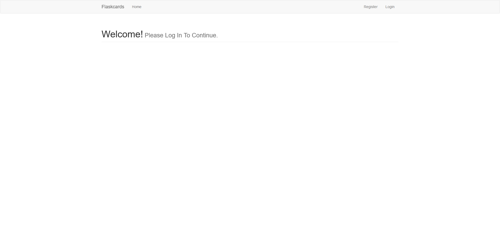
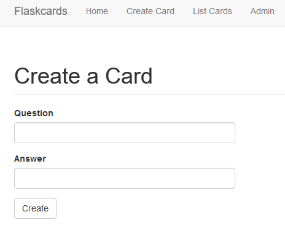
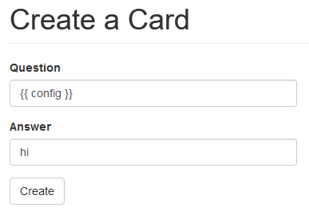
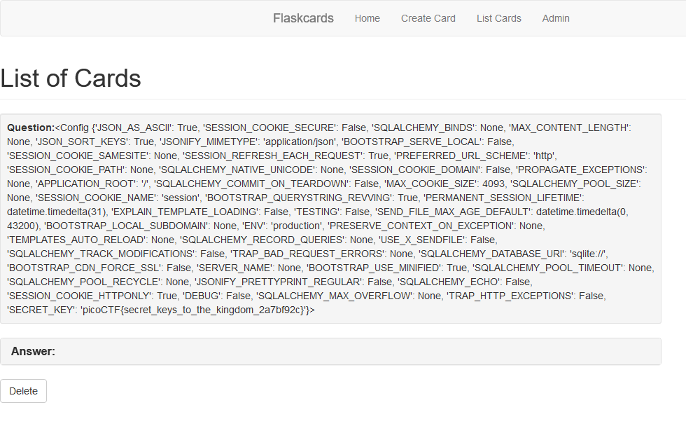

# Flaskcards
Web - 350 Points - 573 Solves (10/12/2018)

> We found this fishy [website](http://2018shell1.picoctf.com:17012/) for flashcards that we think may be sending secrets. Could you take a look?

<details>
  <summary> <b>Hint</b> </summary>
  <ul>
    <li>Are there any common vulnerabilities with the backend of the website?</li>
    <li>Is there anywhere that filtering doesn't get applied?</li>
    <li>The database gets reverted every 2 hours so your session might end unexpectedly. Just make another user</li>
  </ul>
</details>

## Solution
Upon first inspection, the website doesn't appear to have anything too fancy.



After creating a user and logging in, we begin to see a few more pages at our disposal. One such page is the create card page:



Nothing too fancy; just a simple card creation page. However, if we think back to the challenge name, Flaskcards, we can infer that the server is serving a flask page, which is vulnerable to SSTI (Server-Side Template Injection) attacks. Therefore, if we submit a card with a flask templating payload, such as `{{ config }}`, we can leak values from the server.



Once we have created the vulnerable card, we can head over to the `List Cards` page, which provides us with the leaked config values of the flask server, including the flag:



## Flag
```
picoCTF{secret_keys_to_the_kingdom_2a7bf92c}
```

## More Write-ups
-https://ctftime.org/task/6786

